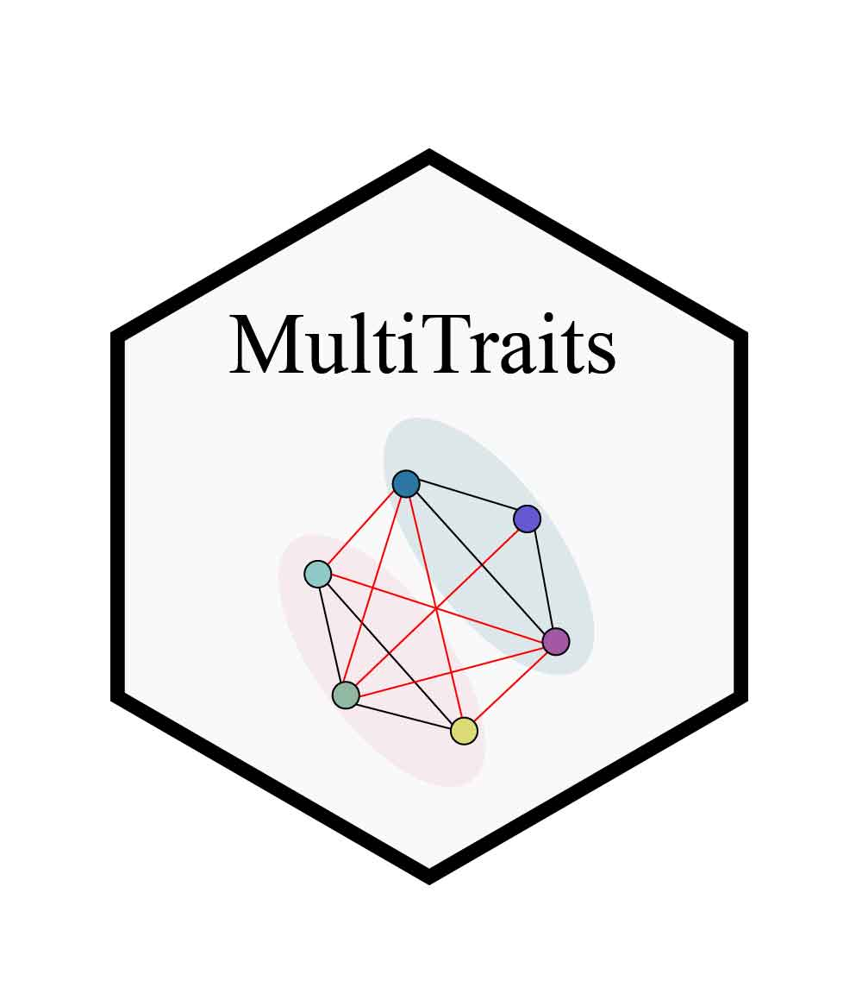
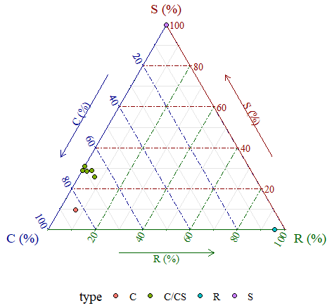
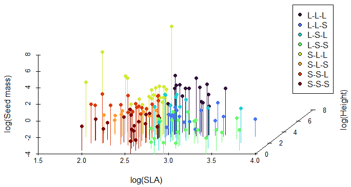
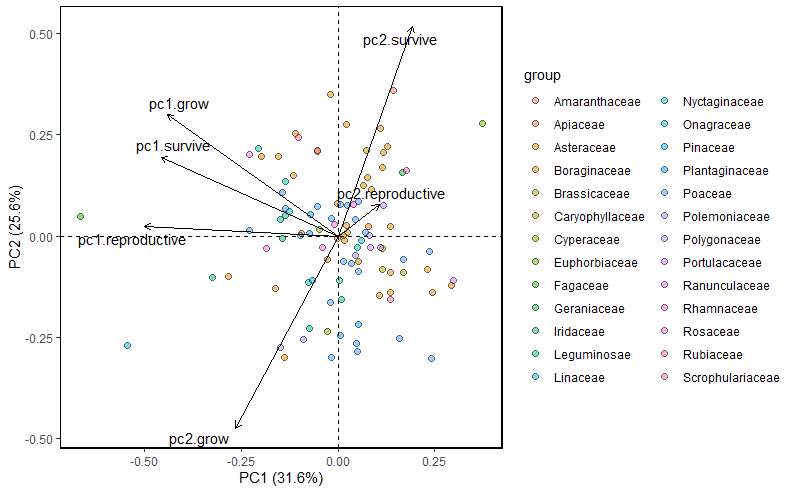
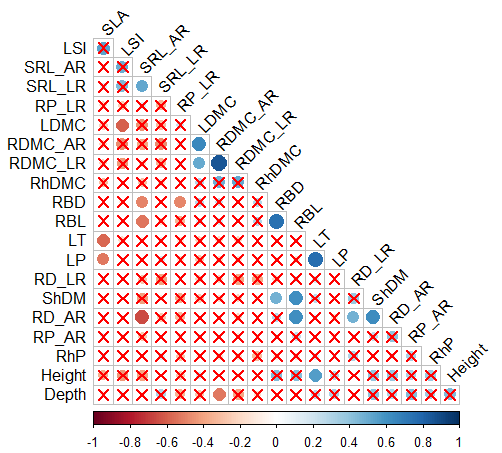
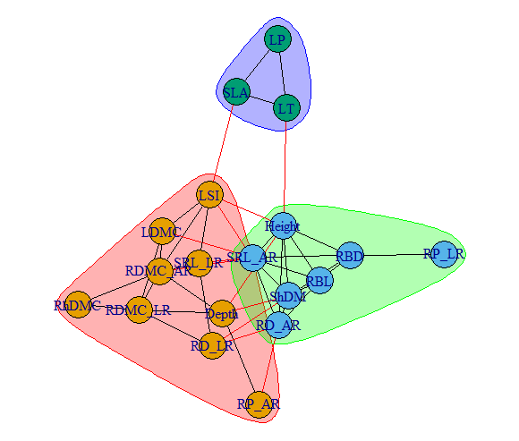

# MultiTraits

The MultiTraits package is a powerful tool for analyzing and visualizing multidimensional traits in plants. It provides a comprehensive set of functions for various trait-based ecological analyses, including CSR strategy analysis, LHS strategy analysis, niche periodicity table analysis, and trait network analysis. This vignette will guide you through the installation process and demonstrate the main functions of the package using example datasets.

## Installation

### From CRAN (recommended)

```{r,class.source = 'fold-show'}
# install.packages("MultiTraits")
```

### From GitHub (development version)

```{r,class.source = 'fold-show'}
# if (!requireNamespace("devtools", quietly = TRUE)) {install.packages("devtools")}
# devtools::install_github("biodiversity-monitoring/MultiTraits")
```

## Main Functions

| Function              | Description                                                                  |
|-------------------------------|----------------------------------------|
| **Data**              |                                                                              |
| PFF                   | Plant Functional Traits Dataset from Ponderosa Pine Forests Flora            |
| WH                    | Wetland Herbaceous Plant Traits Dataset                                      |
| **CSR**               |                                                                              |
| CSR_strategy()        | Calculate CSR (Competition-Stress-Ruderal) Strategy                          |
| CSR()                 | Calculate CSR strategy for multiple plant species                            |
| CSR_plot()            | Create a ternary plot of CSR strategies                                      |
| **LHS**               |                                                                              |
| LHS()                 | Calculate LHS (Leaf-Height-Seed) Strategy                                    |
| LHS_plot()            | Generate a 3D scatterplot of plant traits                                    |
| LHS_strategy_scheme() | Create a table of Leaf-Height-Seed (LHS) strategy types                      |
| **NPT**               |                                                                              |
| NPT()                 | Perform 'PCA of PCAs' for ecological niche periodicity |
| NPT_plot()            | Plot results from nested principal component analysis                        |
| **TN**                |                                                                              |
| TN_corr()             | Calculate and Visualize Plant Trait Correlation Network                      |
| TN()                  | Generate Plant Trait Network                                                 |
| TN_plot()             | Calculate Node and Global Metrics for Trait Networks                         |
| TN_metrics()          | Plot Trait Network Graph                                                     |

### Example Datasets

The MultiTraits package includes two example datasets: PFF and WH. Let's load the package and examine these datasets:

```{r,class.source = 'fold-show'}
library(MultiTraits)
data(PFF)
data(WH)

# View the structure of the datasets
str(PFF)
str(WH)
```

### CSR Strategy

The CSR strategy analysis function allows you to analyze plant strategies based on the CSR (Competitive, Stress-tolerant, Ruderal) theory:

```{r,class.source = 'fold-show'}
LA <- c(369615.7, 11.8, 55.7, 36061.2, 22391.8, 30068.1, 31059.5, 29895.1)
LDMC <- c(25.2, 39.7, 13.3, 35.5, 33.2, 36.1, 35.2, 34.9)
SLA <- c(17.4, 6.6, 34.1, 14.5, 8.1, 12.1, 9.4, 10.9)
traits <- data.frame(LA, LDMC, SLA)
result <- CSR(data = traits)
CSR_plot(data=result)
```



### LHS Strategy

The LHS strategy analysis function helps you analyze plant strategies based on the LHS (Leaf-Height-Seed) theory:

```{r,class.source = 'fold-show'}
data(PFF)
pff <- PFF[, c("SLA", "Height", "SeedMass")]
result <- LHS(pff)
head(result)
LHS_plot(result)
LHS_strategy_scheme()
```



### Niche Periodicity Table

The niche periodicity table analysis function allows you to visualize the distribution of plant traits across different environmental gradients:

```{r,class.source = 'fold-show'}
data(PFF)
PFF[,3:20] <- log(PFF[,3:20])
PFF <- na.omit(PFF)
traits_dimension <-list(
  grow = c("SLA","Leaf_area","LDMC","SRL","Leaf_Nmass","Leaf_Pmass","Root_Nmass"),
  survive = c("Height","Leaf_Cmass","Root_Cmass","Leaf_CN","Leaf_NP","Leaf_CP","Root_CN"),
  reproductive = c("SeedMass","FltDate","FltDur"))
npt_result <- NPT(data = PFF, dimension = traits_dimension)
npt_result
dev.new() # A window that is too small will interfere with the drawing. 
          # Optionally, you can set the drawing window to pop up automatically.
NPT_plot(npt_result$result)
NPT_plot(npt_result$result, PFF$family)
```



### Trait Network

The trait network analysis function helps you explore the relationships between different plant traits:

```{r,class.source = 'fold-show'}
data(WH)
WH <- WH[,4:23]
TN_corr(traits_matrix=WH, rThres = 0.2, pThres = 0.05)
Tn_result <- TN(traits_matrix = WH, rThres = 0.2, pThres = 0.05)
TN_metrics(Tn_result)
TN_plot(Tn_result, style = 1)
```


